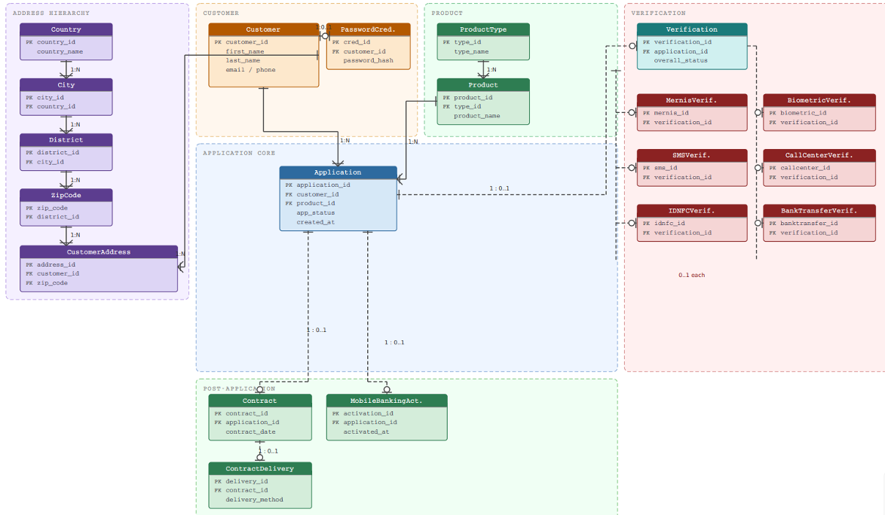
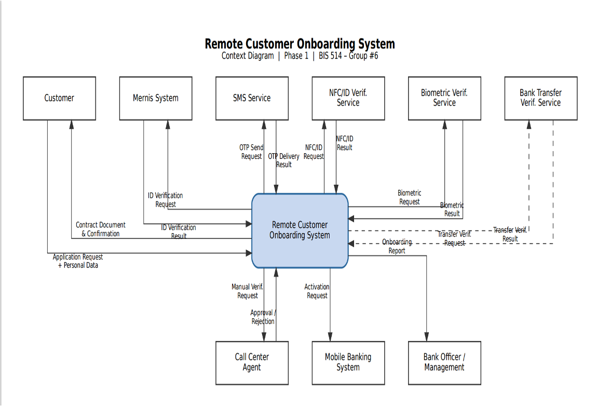
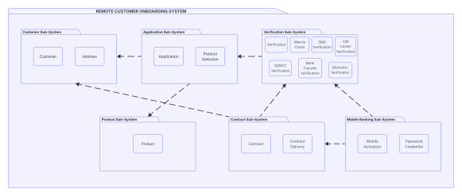
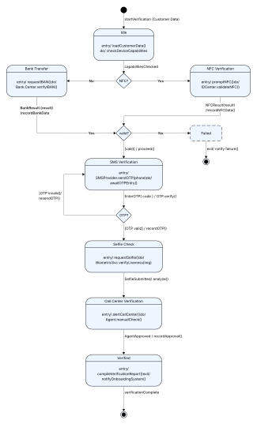
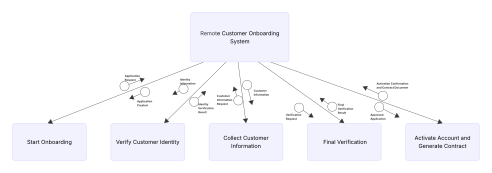
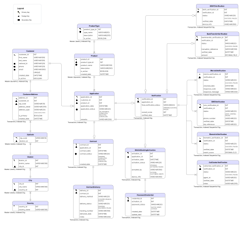
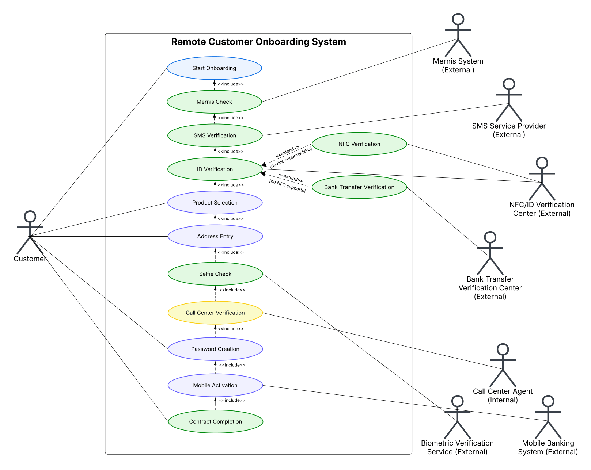
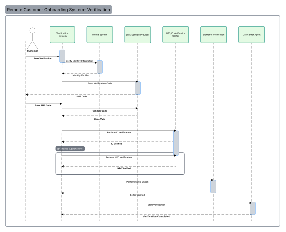

# Remote Customer Onboarding System

## Project Overview

This project is a system analysis and database design project focused on remote customer onboarding for digital banking services.

The system manages the onboarding journey of a customer from application creation to identity verification, address information, product selection, contract generation, and final mobile banking activation.

The project was designed to simulate a secure and user-friendly remote onboarding experience while ensuring traceability, verification control, and structured process management.

---

## Business Problem

Remote onboarding processes can become difficult to manage when customer information, verification steps, onboarding status, and activation processes are handled separately.

Without a structured system, banks may face:
- incomplete onboarding attempts
- verification failures
- poor user experience
- lack of status tracking
- operational inefficiencies
- compliance and auditability issues

This project was designed to model a more organized, trackable, and secure onboarding system.

---

## Project Scope

This project covers the full system analysis and design process for a Remote Customer Onboarding System, including requirements analysis, process modeling, UML diagrams, database design, input/output design, and test case documentation.

---

## System Features

- Customer profile management
- Remote onboarding application tracking
- Identity and phone verification flow
- Mernis validation
- ID / NFC verification
- Biometric selfie verification
- Call center verification
- Product selection
- Address and location management
- Mobile banking activation
- Contract generation and delivery
- Application status tracking
- Alternative verification flow support

---

## Main Deliverables

- Requirements Identification
- Event Table
- Entity-Relationship Diagram (ERD)
- Data Flow Diagrams (DFD)
  - Context Diagram
  - Level 0 Diagram
  - Sub-diagram
- Use Case Diagram
- Class Diagram
- Sequence Diagram
- Statechart Diagram
- Top Structure Chart
- Package Diagram
- Relational Database Design
- System Input & Output Designs
- Menu Hierarchy
- Test Case Documentation
- Requirements Elicitation Questionnaire
- Competitor Benchmarking

---

## Verification & Business Logic

One of the most important parts of the system is the identity verification process.

The onboarding flow includes:
1. Mernis identity validation
2. SMS / OTP verification
3. ID and NFC verification
4. Biometric selfie verification
5. Call center approval

The system also supports an alternative verification path.

If the customer’s device supports NFC, onboarding continues through NFC-based identity verification.

If NFC verification cannot be completed, the system can continue through bank transfer-based verification.

This creates a more flexible onboarding experience and reduces onboarding failure rates.

---

## Requirement Research

The project also includes a requirements elicitation study based on a questionnaire with 50 participants.

The findings were translated into system requirements such as:
- security transparency
- step-by-step onboarding guidance
- retry mechanisms after failed verification
- alternative verification methods
- real-time application tracking
- mobile-first onboarding optimization

The project also includes competitor benchmarking and document analysis of digital banking onboarding practices.

---

## Database & System Design

The database and system architecture were designed to support:
- normalized data management
- verification traceability
- audit-ready records
- scalable onboarding workflows
- modular verification components

The address structure was normalized using:
Country → City → District → ZipCode hierarchy.

Verification processes were modeled as separate entities to support flexibility and extensibility.

---

## Technologies & Methods Used

- System Analysis and Design
- UML Modeling
- ER Modeling
- Relational Database Design
- Business Process Modeling
- Requirements Analysis
- Process Documentation

---

## Project Files

- Project Report
- Presentation
- ER Diagram
- Context Diagram
- Data Flow Diagrams
- Use Case Diagram
- Class Diagram
- Sequence Diagram
- Statechart Diagram
- Top Structure Chart
- Package Diagram
- Relational Database Design
- Test Case Documentation

---

## Key Learning Outcomes

Through this project, I improved my understanding of:
- remote onboarding systems
- business process modeling
- UML and system design documentation
- verification workflow design
- database architecture
- requirements analysis
- process-oriented thinking
- product-oriented system analysis

---

## System Diagrams

### ER Diagram

---

### Context Diagram

---

### Package Diagram

---

### Statechart Diagram

---

### Top Structure Chart

---

### Relational Database Design

---

### Use Case Diagram

---

### Sequence Diagram

